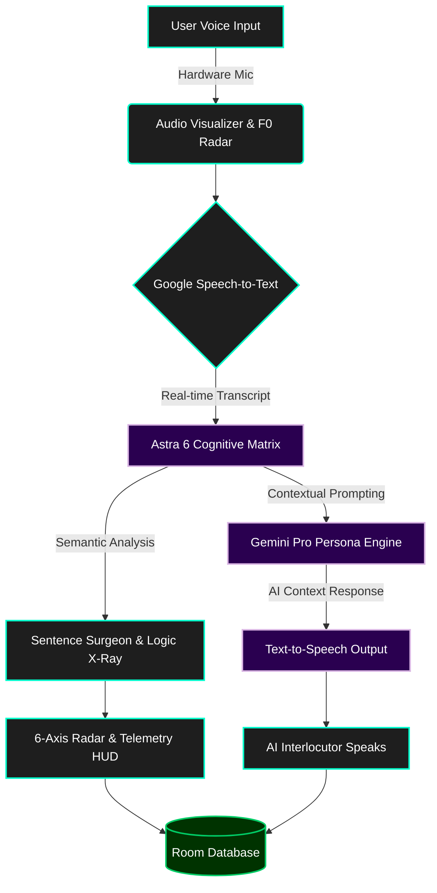

# Vocalis — Executive AI Speech & Interview Intelligence

[](https://opensource.org/licenses/MIT)
[](https://kotlinlang.org)
[](https://developer.android.com/jetpack/compose)

**Vocalis** is an executive-grade AI speech, viva, and high-stakes interview intelligence platform. Designed with the precision and aesthetics of modern developer-first SaaS (Linear, Raycast, Stripe), Vocalis enables developers, founders, executives, and students to rehearse high-stakes conversations out loud — before facing the real challenge.

---

## 🛠️ Technology Stack

- **UI & Core**: [Kotlin 2.2](https://kotlinlang.org/) & [Jetpack Compose Material 3](https://developer.android.com/jetpack/compose)
- **AI & NLP**: [Google Gemini Pro](https://deepmind.google/technologies/gemini/) (Persona Engine & Astra 6 Matrix)
- **Audio Processing**: Custom Multi-Harmonic Wave Visualizer & F0 Radar
- **Local Persistence**: Room Database (Offline-first) & DataStore
- **Monetization Engine**: [RevenueCat SDK](https://www.revenuecat.com/)
- **Backend & Security**: Google Cloud Run, Secret Manager & Firestore

---

## 🔄 System Architecture & Flowchart



---

## 🛡️ Security & Privacy

We take user privacy and application security seriously. Here is how we address potential risks:

- **Input Sanitization**: Strict parameterization and null-character sanitization to prevent prompt injection or parsing errors.
- **LLM Safety Boundaries**: Isolated system instructions and rigid schema parsing ensure consistent and safe AI persona behavior.
- **API Resilience**: Fallback mechanisms with exponential backoff and localized heuristics protect against network interruptions and rate limits.
- **Data Persistence**: Offline-first Room database with atomic transactions keeps local rehearsal data safe and private.
- **Encrypted Transmission**: Strict HTTPS enforcement and secret isolation via `BuildConfig`.

---

## 🚀 Key Features

1. **Acoustic Lab & Real-Time Wave Visualizer**:
   - **Multi-Frequency Bézier Canvas Waveform**: Superposition of fundamental voice frequency, 2nd harmonic resonance, and presence overtones with smooth Hann window edge tapering and animated glowing crest nodes.
   - **Dynamic Amplitude & Decibel Metering**: Live decibel level meter (-48 dBFS ambient to -6 dBFS peak) dynamically tracking Android microphone input with spring-physics interpolation.
   - **5-Band Harmonic Resonance Spectrum**: Real-time acoustic EQ bands (Sub 60Hz, Body 250Hz, Warmth 800Hz, Presence 2.5kHz, Air 8kHz).
   - **F0 Fundamental Pitch & Jitter Radar**: Radial sweep gauge tracking human voice fundamental pitch (80 Hz to 240 Hz), vocal jitter percentage (<1.0% presidential stability), singer's ring formant, and vocal strain warnings.
   - **Keynote Orator Teleprompter**: Autoscrolling teleprompter with target cadence tempo (110 - 185 WPM), live cue hints (`[PAUSE 2s • SURVEY AUDIENCE]`, `[TRIADIC REPETITION]`), and preloaded Silicon Valley scripts (Steve Jobs 2007 iPhone keynote, Satya Nadella AI shift, Jensen Huang GTC, YC Demo Day pitch).
   - **4 Acoustic Performance Pillars**: Real-time telemetry monitoring Vocal Resonance, Diaphragmatic Stability, Speech Cadence (WPM), and Harmonic Clarity.
   - **Guided Vocal Calibration Prompts**: Pre-loaded executive prompts for instant voice calibration before high-stakes presentations.
   - **Dual Source Engine**: Supports both hardware microphone stream and simulated acoustic synthesis for instant zero-dependency testing on any device or emulator.

2. **Cognitive Matrix & 6-Axis Radar**:
   - **Interactive 6-Axis Canvas Neural Radar**: Evaluates Clarity, Gravitas, Structure, Stress Resilience, Vocal Cadence, and Executive Brevity with real-time benchmarks comparing performance to the Top 5% executive standard.
   - **Vocal & Speech Telemetry HUD**: Live real-time words-per-minute (WPM) speedometer, acoustic RMS decibel resonance, and instant vocal filler alarm during live speech capture.
   - **"Sentence Surgeon" Autopsy**: Color-coded linguistic dissection isolating passive hedging, narrative drift, and confidence-deflating qualifiers, paired with side-by-side **Executive Level 10 Rewrites** grounded in the BLUF (Bottom Line Up Front) framework.
   - **Socratic Stress Interrupter (Shadow Opponent Mode)**: Live pressure test interruptions injecting sharp counter-arguments, budgetary pushbacks, and technical edge-case challenges mid-speech with a 15-second countdown timer to test fight-or-flight composure.

2. **Intelligent Persona Inference**:
   - Single open goal input (*"DBMS viva exam"*, *"Frontend React interview"*, *"Asking my manager for a 20% raise"*).
   - Tone selector: **Supportive**, **Standard**, and **Tough** (high-stakes stress testing).
   - Gemini dynamically infers the examiner, interviewer, or executive persona, generating opening prompts and contextual scene setting.

2. **Full Voice-to-Voice Practice Loop**:
   - **Text-to-Speech (TTS)**: Reads AI prompts aloud with authentic vocal pacing.
   - **Speech Recognition (STT)**: Transcribes the user's spoken responses in real-time with waveform audio visualizer.
   - **Manual Typing Fallback**: Allows typing or editing speech transcripts for accessibility or noisy environments.
   - **Multi-Turn Exchange**: Up to 5 interactive exchanges with immediate in-character reactions, turn scores, and targeted tips.
   - **Final Scorecard**: 0–10 rating, verdict, key strengths, and actionable areas for improvement.

3. **Manager Rehearsal Lab**:
   - Specific scenarios crafted for new engineering and product managers:
     - Feedback to a Defensive Teammate
     - Setting Boundaries with an Overstepping VP
     - Saying 'No' to Out-of-Scope Requests
     - Resolving Direct Report Feuds
     - Addressing Chronic Missed Deadlines
     - Announcing Unpopular Strategic Pivots

4. **Room Database History & Trajectory**:
   - Local offline persistence for all completed sessions.
   - Canvas-rendered interactive **Score Trend Chart** showing score evolution across sessions and average reference lines.
   - Full transcript inspector allowing users to re-read and re-listen to previous rehearsals.

5. **RevenueCat Monetization & Gating Engine**:
   - Free tier: 3 daily sessions, Standard and Supportive tones.
   - Pro tier: Unlimited daily sessions, Tough Mode unlocked, downloadable prep reports.
   - Offerings: Annual ($39.99/yr, 7-Day Free Trial), Monthly ($6.99/mo), Lifetime ($89.99).

6. **Universal Inclusivity & Multi-Field Domain Hub (For Everyone, in Every Field)**:
   - **For Children & Students**: School science presentations, college thesis vivas, Model UN debate, and stage-fright confidence builders.
   - **For Job Seekers & Daily Workers**: First-job interview openings ("Tell me about yourself"), retail customer de-escalation, and schedule/wage adjustments.
   - **For Healthcare Professionals**: Doctor-patient compassionate diagnoses, clinical SBAR shift handoffs under pressure.
   - **For Tech & Business Executives**: FAANG Staff-level distributed systems screens, YC 60-second pitches, executive compensation reviews.
   - **For Seniors & Golden Age Elders**: Heartfelt family anniversary toasts, diaphragmatic breath maintenance, and speech longevity exercises.
   - **Zero-Data Equity & Universal Device Support**: Runs seamlessly on low-cost devices and high-end foldables; 100% offline simulation fallback when no data plan or internet is available.
   - **Accessibility & Senior Mode**: One-tap Large Text scaling, high-contrast visual cues, minimum 48dp x 48dp touch targets, and full TalkBack semantics.

7. **AI Debate Gauntlet & Verbal Sparring Arena**:
   - 60-second high-adrenaline adversarial cross-examinations against tier-one AI opponents (*Victoria Sterling, VC General Partner*; *David Cross, Investigative Reporter*; *Viktor Kozlov, Hostile M&A Director*).
   - Real-time **Composure Shield** that penalizes fluff, hesitation, and filler words.
   - Hardware-level CDMA stress siren feedback (`ToneGenerator`) and live waveform visualizer.

8. **Verified Executive Orator Credential & Cryptographic Dossier**:
   - High-aesthetic gold parchment credential with verified hologram seal and cryptographic SHA-256 audit hash.
   - Comprehensive 4-pillar diagnostic breakdown: Clarity, Gravitas, Structure, and Stress Resilience.
   - 1-tap **Share Verified Executive Dossier** system intent to export executive briefings directly to leadership, recruiters, or investors.

---

## ☁️ Google Cloud Run & Backend Deployment Guide

If deploying a server-side proxy or microservice backend on Google Cloud Run:

### 1. Prerequisites
Ensure the Google Cloud SDK (`gcloud`) is installed and authenticated:
```bash
gcloud auth login
gcloud config set project YOUR_PROJECT_ID
gcloud services enable run.googleapis.com secretmanager.googleapis.com firestore.googleapis.com
```

### 2. Secret Manager Setup
Create and securely store the Gemini and RevenueCat API keys in Secret Manager:
```bash
# Create and populate secrets
gcloud secrets create GEMINI_API_KEY --replication-policy="automatic"
echo -n "YOUR_GEMINI_API_KEY" | gcloud secrets versions add GEMINI_API_KEY --data-file=-

gcloud secrets create REVENUECAT_PUBLIC_API_KEY --replication-policy="automatic"
echo -n "YOUR_REVENUECAT_KEY" | gcloud secrets versions add REVENUECAT_PUBLIC_API_KEY --data-file=-

# Grant default Cloud Run service account access
PROJECT_NUMBER=$(gcloud projects describe $(gcloud config get-value project) --format='value(projectNumber)')
gcloud secrets add-iam-policy-binding GEMINI_API_KEY \
  --member="serviceAccount:${PROJECT_NUMBER}-compute@developer.gserviceaccount.com" \
  --role="roles/secretmanager.secretAccessor"
```

### 3. Deploy to Cloud Run
Deploy with container build and environment variable referencing Secret Manager:
```bash
gcloud run deploy vocalis-service \
  --source . \
  --region asia-southeast1 \
  --platform managed \
  --allow-unauthenticated \
  --set-secrets="GEMINI_API_KEY=GEMINI_API_KEY:latest,REVENUECAT_PUBLIC_API_KEY=REVENUECAT_PUBLIC_API_KEY:latest"
```

### 4. Verification Binding Label
Apply the required campaign label for automated verification:
```bash
gcloud run services update vocalis-service \
  --update-labels=dev-tutorial=cloud-run-ai-challenge \
  --region=asia-southeast1
```

### 5. Firestore Security Rules
For multi-device synchronization and cloud data storage:
```javascript
rules_version = '2';
service cloud.firestore {
  match /databases/{database}/documents {
    match /users/{userId}/interactions/{interactionId} {
      allow read, write: if request.auth != null && request.auth.uid == userId;
    }
  }
}
```

---

## 🚀 Getting Started

### 1. Launching a Rehearsal
- Open Vocalis and navigate to the **Rehearse** tab.
- Enter your goal (e.g., "System Design Interview" or "Asking for a raise").
- Select your preferred persona tone (Supportive, Standard, or Tough) and tap **Begin Rehearsal**.

### 2. Voice Interaction
- Tap the **Microphone Button** to speak your response out loud. 
- The live waveform visualizer will pulse in sync with your voice input.
- You can also type or edit your response manually by tapping the **Edit** icon.
- Tap **Send Answer** to receive immediate AI feedback, turn scores, and the follow-up question.

### 3. Reviewing Performance
- After your session, navigate to the **History** tab to see your Score Trajectory Chart.
- Tap on any past session to read the full dialogue transcript and review actionable tips.
- Check the **Neural Matrix** for a comprehensive breakdown of your Clarity, Gravitas, Structure, and Resilience.

### 4. Specialized Labs & Tools
- **Manager Lab**: Practice handling difficult workplace scenarios like setting boundaries or delivering constructive feedback.
- **Acoustic Studio**: Monitor your real-time vocal metrics including WPM, resonance, and fundamental pitch.
- **Teleprompter**: Practice delivery pacing using iconic keynote scripts with built-in speed tracking.
- **Debate Gauntlet**: Engage in fast-paced, high-stress verbal sparring to test your composure under pressure.
